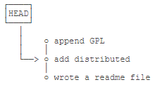

#### 分布式和集中式版本控制系统

git的分布式和cvs/svn集中式的版本控制系统，他们有什么区别？

集中式版本控制系统：版本库是集中存放在中央服务器的，而干活的时候，用的都是自己的电脑，所以要先从中央服务器取得最新的版本，然后开始干活，干完活了，再把自己的活推送给中央服务器。


集中式的最大问题：必须联网才能工作，如果在局域网内还好，带宽够大，速度够快，可如果在互联网上，遇到网速慢的话，可能提交一个10M的文件就需要5分钟，这还不得把人给憋死啊。

和集中式版本控制系统相比，分布式版本控制系统根本没有“中央服务器”，每个人的电脑上都是一个完整的版本库，这样，你工作的时候，就不需要联网了，因为版本库就在你自己的电脑上。既然每个人电脑上都有一个完整的版本库，那多个人如何协作呢？比方说你在自己电脑上改了文件A，你的同事也在他的电脑上改了文件A，这时，你们俩之间只需把各自的修改推送给对方，就可以互相看到对方的修改了。

分布式的优点：安全性要高很多，因为每个人电脑里都有完整的版本库，某一个人的电脑坏掉了不要紧，随便从其他人那里复制一个就可以了。而集中式版本控制系统的中央服务器要是出了问题，所有人都没法干活了。


>   在实际使用分布式版本控制系统的时候，其实很少在两人之间的电脑上推送版本库的修改，因为可能你们俩不在一个局域网内，两台电脑互相访问不了，也可能今天你的同事病了，他的电脑压根没有开机。因此，分布式版本控制系统通常也有一台充当“中央服务器”的电脑，但这个服务器的作用仅仅是用来方便“交换”大家的修改，没有它大家也一样干活，只是交换修改不方便而已。

#### 安装并配置

安装完git后，需要进一步设置：

```
> $ git config --global user.name 'your name'
> $ git config -- global user.email 'your email'
```

>   -   因为Git是分布式版本控制系统，所以，每个机器都必须自报家门：你的名字和Email地址。
>   -   注意config命令的global全局参数，用了这个参数，表示你这台机器上所有的Git仓库都会使用这个配置，当然也可以对某个仓库指定不同的用户名和Email地址。

分布式还有的优点：分支管理

----

#### 什么是版本库

版本库又名仓库，英文名repository，你可以简单理解成一个目录，这个目录里面的所有文件都可以被Git管理起来，每个文件的修改、删除，Git都能跟踪，以便任何时刻都可以追踪历史，或者在将来某个时刻可以“还原”。

所以，创建一个版本库非常简单，首先，选择一个合适的地方，创建一个空learngit目录：
```$ mkdir learngit
$ cd learngit
$ pwd
/d/git/net/learn_git
```

第二步：通过 `git init` 命令(初始化)把这个目录变成git可以管理的仓库
```
$ git init
Initialized empty Git repository in D:/git/net/learn_git/.git/
```

瞬间Git就把仓库建好了，而且告诉你是一个空的仓库（empty Git repository），细心的你可以发现当前目录下多了一个 .git 的目录，这个目录是Git来跟踪管理版本库的，没事千万不要手动修改这个目录里面的文件，不然改乱了，就把Git仓库给破坏了。

----

#### 把文件添加到版本库中

>   git只能跟踪文本文件的改动，比如第5行改动了什么；二进制文件虽然也可以管理，但是其改动的变化是无法跟踪的；

在 .git 同目录下新建  readme.txt  文件，使用urf-8编码

第一步：使用命令 `git add` 告诉git，把文件添加到暂存区中

`$ git add readme.txt`

执行上面的命令，没有任何显示，这就对了，Unix的哲学是“没有消息就是好消息”，说明添加成功。


第二步：使用命令  git commit 告诉Git，把文件从暂存区提交到仓库中：

`$ git commit -m 'wrote a readme file'`

>   -m   本次提交的说明

`git commit` 命令执行成功后会告诉你，1个文件被改动（我们新添加的readme.txt文件）


思考：为什么Git添加文件需要 add 和 commit 两个命令呢？

因为：commit 命令可以一次提交很多文件，所以你可以多次add不同的文件，比如：

```
> $ git add file2.txt file3.txt
> $ git add file1.txt
```

然后一次性 commit 提交

```
> $ git commit -m 'add 3 files.'
```


修改readme.txt内的内容

运行命令 `git status` 命令查看结果：

```
On branch master  // 在主分支上
Changes not staged for commit:   // 修改未提交
  (use "git add <file>..." to update what will be committed)   // 使用命令  git add <file> 更新提交的内容
  (use "git checkout -- <file>..." to discard changes in working directory)

        modified:   readme.txt    // 修改：readme.txt

no changes added to commit (use "git add" and/or "git commit -a")   // 没有添加更改
changes not staged for commit   修改未提交
```

当在仓库中的readme.txt文档被修改，而又不知道改哪里的时候，可以使用命令  `git diff` 来查看修改的地方

```
$ git diff 文件名
```

查看差异difference，显示格式为Unix通用的diff格式

现在已知文档修改的地方了，可以放心提交到仓库中了，提交修改和提交更新是两个不同的命令

第一步：提交修改

```
$ git add readme.txt
```

查看当前的状态

```
$ git status
```

状态中告诉我们提交的修改包括 readme.txt

第二部：提交到库中：

```
$ git commit -m 'add distributed'
```

再查看当前的状态

```
$ git status

# On branch master
nothing to commit (working directory clean)
```

Git告诉我们当前没有需要提交的修改，而且，工作目录是干净（working directory clean）的。

---

#### 版本回退   仓库回退到某一版本（重要）

git中，每当文件commit的时候，就相当git中保存的一个快照，这个快照在git中被称为 `commit`

命令 `git log` 可以查看从最近到最远的提交日志

单行显示log
`$ git log --pretty=oneline`

>   4c88df...0be397 被称为commit的id(SHA1计算出来的十六进制版本号id)

在git中，使用HEAD参数表示当前版本，上一版本就是HEAD^，上上版本就是HEAD^^，50个版本前就是HEAD~50

使用 `git reset--hard 版本` 命令回退

```
$ git reset --hard HEAD^
$ git reset --hard HEAD~2
```

--hard参数有啥意义？这个后面再讲


回退的版本我想再回去呢？就好比你从21世纪坐时光穿梭机来到了19世纪，想再回21世纪去已经回不去了，肿么办？办法其实还是有的：

1、只要上面的命令行窗口还没有被关掉，你就可以顺着往上找啊找啊，找到那个 commit id，于是就可以指定回到未来的某个版本：

```
$ git reset --hard 你未来的版本ID
```

你会发现使用 $ git log 查看已经不见最新的版本了，现在你该如何恢复到未来的某个版本？

如果当前窗口没关闭的话可以在当前窗口向上翻查看最新的commit id版本号，然后使用reset命令

```
$ git reset --hard commid_id
```

>   PS：版本号没必要写全，前几位就可以了，Git会自动去找

2、如果窗口关闭了完全不知道commitid ，可以通过下面命令查看你每一次的操作，然后使用版本回退命令恢复即可

```
$ git reflog
```

---

>   git的版本回退速度非常快，因为git在内部有个指向当前版本的HEAD指针，当你回退版本的时候，git仅仅是把HEAD从指当前版本的改为指向前一个版本。


改为指向add distributed：



然后顺便把工作区的文件更新了。所以你让HEAD指向哪个版本号，你就把当前版本定位在哪。